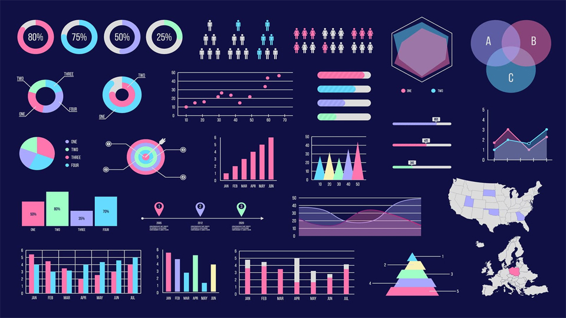

```{r setup, include=FALSE}
knitr::opts_chunk$set(echo = TRUE)
```

## Introducción

En el presente documento se elaborarán algunos tipos de gráficos para la visualización de datos.

Primero se instalan las librerías a utilizar

```{r}
library(dplyr)
library(ggplot2)
library(haven)
library(utils)
```


Con la siguiente función se elabora el área del gráfico sin ninguno de los datos dentro.

```{r, fig.align='center'}
ggplot(mtcars,
       aes(x=mpg,y=disp,color=factor(cyl),
           shape=factor(carb),size=hp))
```

Con *geom_point()* se colocan los puntos de las variables dentro del área.

```{r, fig.align='center'}
ggplot(mtcars,
       aes(x=mpg,y=disp,color=factor(cyl),
           shape=factor(carb),size=hp)) + 
  geom_point()
```


Adicionalmente, con *geom_line()* se unen los puntos creados mediante líneas.

```{r, fig.align='center'}
ggplot(mtcars,
       aes(x=mpg,y=disp,color=factor(cyl),
           shape=factor(carb),size=hp)) + 
  geom_point() +
  geom_line()
```

Se establece la dirección en la cual se encuentran los archivos a trabajar, y se importan las bases de datos a trabajar, obtenidas de los microdatos del INEI.

```{r}
setwd("C:/Rstudio/analisislambda")
sumaria <- read_dta("634-Modulo34/sumaria-2018.dta")
educacion <- read_dta("634-Modulo03/enaho01a-2018-300.dta")
```

A partir de la base de datos **sumaria** se elabora otra base mediante algunas de sus variables, a la que se llamará ***baseinicial***:

```{r program}
baseinicial <- merge.data.frame(x = sumaria, y = educacion, by = intersect(c("conglome","vivienda","hogar"), c("conglome","vivienda","hogar")))
```

Y se elabora posteriormente ***basefinal***:

```{r}
basefinal <- baseinicial[,c("conglome", "vivienda", "hogar","mes.x","dominio.x", "estrato.x", "mieperho", "inghog2d", "gashog2d", "linpe","pobreza","estrsocial", "codperso", "codinfor", "p300a", "p301a", "p301d", "p207","p209")]
```


```{r}
basefinal$p207 <- factor(basefinal$p207,label = c("hombre","mujer"))
basefinal$p209 <- factor(basefinal$p209,label = c("conviviente","casado","viudo","divorciado","separado","soltero"))
```

Se renombran algunas de las variables contenidas en ***basefinal***

```{r}
basefinal <- rename(basefinal,"Sexo"=p207)
basefinal <- rename(basefinal,"Estado civil"=p209)
```

---

## Box plot

El primer gráfico a elaborar será un *diagrama de caja* o *box plot* mediante **geom_boxplot**

```{r boxplot, fig.align='center'}
ggplot(sumaria,aes(x=mes,y=inghog2d)) +
  geom_boxplot() +
  ggtitle("Gráfico de ingresos por mes", subtitle = "(En soles, s/.)") +
  xlab("Meses del año") +
  ylab("Ingreso del hogar")
```

---

## Gráfico de Dispersión

Un segundo gráfico que realizaremos será un *gráfico de dispersión* mediante **geom_scatter**

```{r scatter, fig.align='center'}
ggplot(basefinal,aes(gashog2d,inghog2d)) +
  geom_point(aes(color = factor(Sexo)))


ggplot(basefinal,aes(gashog2d,inghog2d)) +
  geom_point(aes(color = factor(pobreza),alpha = 0.2))

```

---

## Histograma

Ahora se elaborará un *histograma* mediante **geom_histogram**

```{r histogram, fig.align='center'}
ggplot(sumaria,aes(gashog2d)) +
  geom_histogram(bins = 100)
```

Se puede personalizar el color del histograma, mediante la opción *color*:

```{r histogram2, fig.align='center'}
ggplot(sumaria,aes(gashog2d)) +
  geom_histogram(bins = 100, color = "blue")
```

Asimismo, se puede personalizar aún más el gráfico, mediante la opción *fill*

```{r histogram3, fig.align='center'}
ggplot(sumaria,aes(gashog2d)) +
  geom_histogram(bins = 100, color = "blue", fill = "green")
```

---

## Gráfico de Barras

Se crea una variable llamada ***grafico*** compuesta por las variables *estrato social* y *sexo*

```{r}
grafico <- basefinal %>% 
  group_by(estrsocial, Sexo) %>% 
  summarise(gasto = round(mean(gashog2d),2))
```

Por último, se realizarán *gráficos de barras* mediante **geom_bar**

```{r barras, fig.align='center'}
ggplot(grafico, aes(x = as.integer(estrsocial), y = gasto, fill = as.factor(Sexo))) +
  geom_bar(stat= "identity")
```


Se personaliza el gráfico mediante la opción **geom_text**, para colocar el valor de las variables en el gráfico, así como su posición relativa

```{r barras2, fig.align='center'}
ggplot(grafico, aes(x = as.integer(estrsocial), y = gasto, 
                    fill = as.factor(Sexo), 
                    label = scales::comma(gasto, accuracy = 2))) +
  geom_bar(stat= "identity", show.legend = T) + 
  geom_text(size = 2.5, position = position_stack(vjus = 0.75))
```


<center>

</center>


